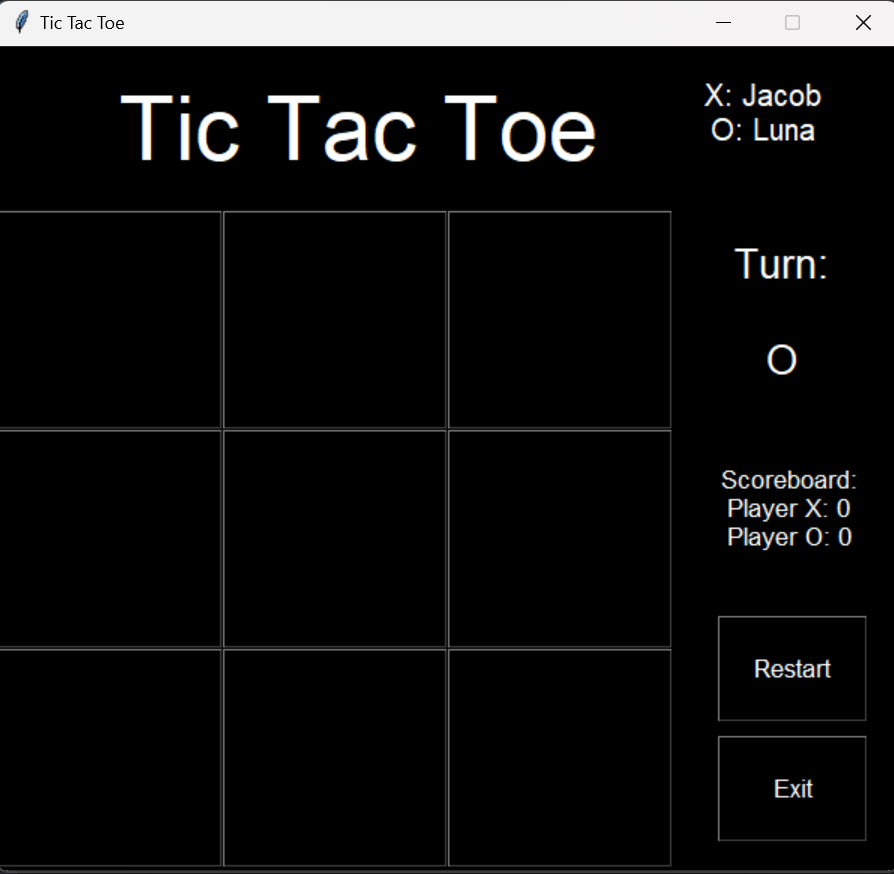
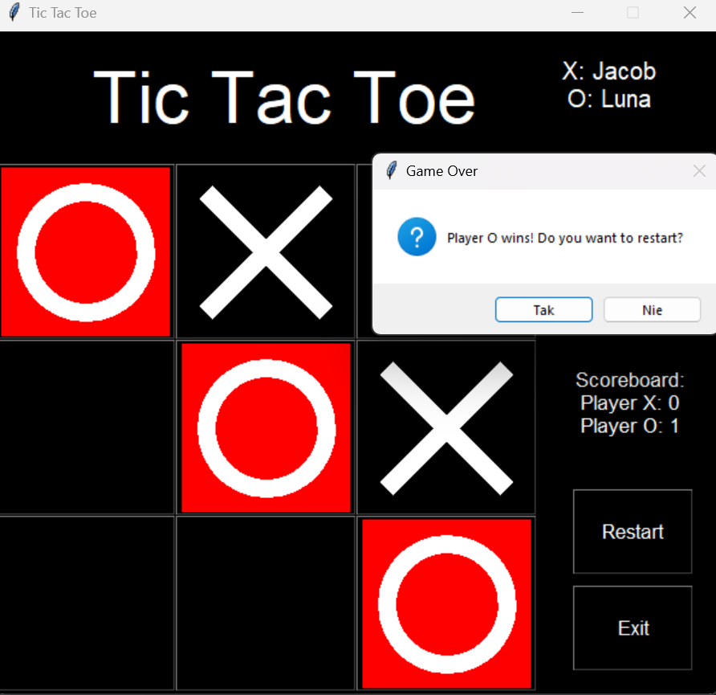
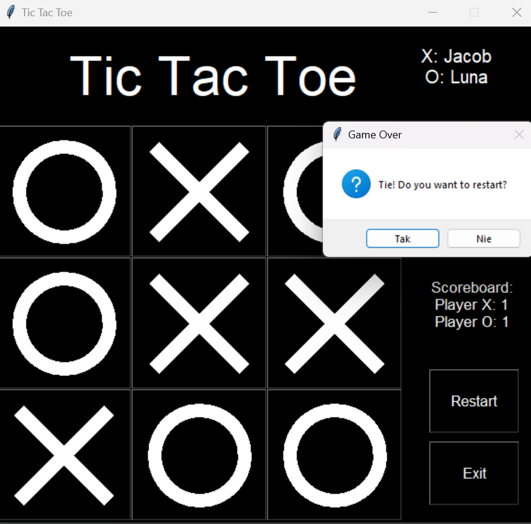
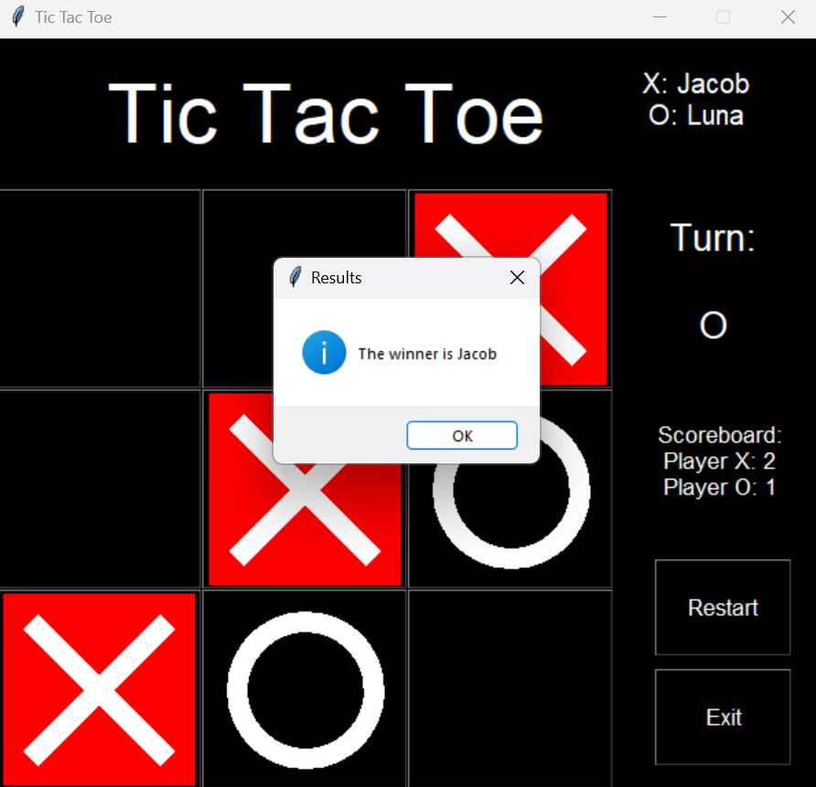

# Tic-Tac-Toe
  
  

## Table of contents: 
* [General info](#general-info)
* [Requirements](#requirements-and-used-libraries)
* [Setup](#setup)
* [Status](#setup)
### General info
The aim of this project is to create simple Player vs Player (PvP) Game: Tic Tac Toe fully written in python.
It focuses on developing skills connected with OOP.
### Requirements and used libraries
Python 3.8+, tkinter
### Setup
1. First, clone this repository:
   ```sh
   git clone https://github.com/natix-x/Tic-Tac-Toe.git
   ```
2. Run main.py
```sh
   python main.py
   ```
### Status
Game functionalities:
* creates game board 
* presents whose turn is now
* adds points to scoreboard after each round
* gives possibility of restarting game board at any time from right menu
* gives possibility for players for choosing their nicknames and signs (X or 0) at the begging of the game
* draws first player
* displays players' nicknames during whole game
* gives possibility of exiting game at any time from right menu
* gives possibility of restarting whole game after exiting
* displays message at the end about winner of the whole game

